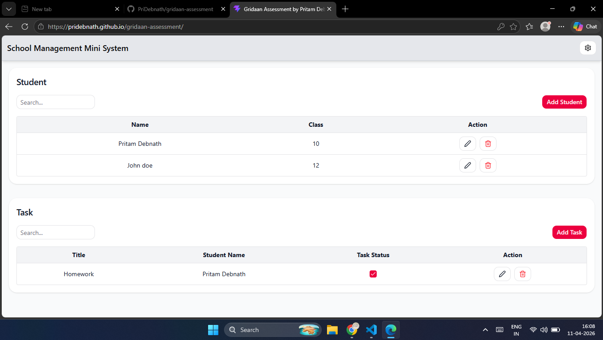

## 🔴 Demo
### 🔴 ↗️ Link
https://pridebnath.github.io/gridaan-assessment


### 🔴 🖼️ Screenshot

<a href="https://pridebnath.github.io/gridaan-assessment">

</a>


### 🔴 🎥 Video

https://github.com/user-attachments/assets/e4f31396-cb7c-4d56-bd49-55c7bd340cb2


⬇️ <a href="frontend/public/gridaan-assessment-by-pritam-debnath.mp4" download="gridaan-assessment-by-pritam-debnath.mp4">
  Download Demo Video
</a>


---

# School Management Mini System (MERN Stack)

A full-stack web application designed to manage basic school operations such as student records and task assignments, with secure admin authentication.

---

## 📌 Overview

This project demonstrates the implementation of a full-stack CRUD system with authentication and relational data handling.

The application allows an admin to:

- Manage student records (add, edit, delete, view)
- Assign and track tasks/homework for students
- Authenticate securely before accessing the dashboard

---

## 🧱 Tech Stack

### Frontend

* React (Vite)
* Shadcn UI
* TanStack Query 

### Backend

* Node.js
* Express.js

### Database

* MongoDB (Mongoose)

## Authentication
- JWT (JSON Web Tokens)
- bcrypt (for password hashing)
---

## ⚙️ Features

### Authentication
- Admin login system
- Protected dashboard routes
- Secure password handling using hashing

### Student Management
- ➕ Add new students
- ✏️ Edit student details
- ❌ Delete students
- 📋 View all students

### Task / Assignment Management
- Assign tasks/homework to students
- Mark tasks as completed
- View all assigned tasks

### Dashboard
- Centralized admin panel after login
- Displays:
  - Student list
  - Task/assignment list
- Data Persistence
  - All data stored in MongoDB
  - RESTful APIs for frontend-backend communication

---


---
# Set Up 
## Frontend Set Up
```
cd gridaan-assessment
``` 
```
pnpm install
``` 
```
npm run corepack:enable
``` 
```
cd frontend
``` 
```
npm run dev
``` 
## Backend Set Up
```
cd gridaan-assessment
``` 
```
pnpm install
``` 
```
npm run corepack:enable
``` 
```
cd backend
``` 
```
copy .env.example .env
```
Add your keys in .env file
```
npm run dev
```
---

#  Docs
## Backend docs
### Environment variables
```
PORT=8000

MONGO_URI=connection-string-from-db-provider
```